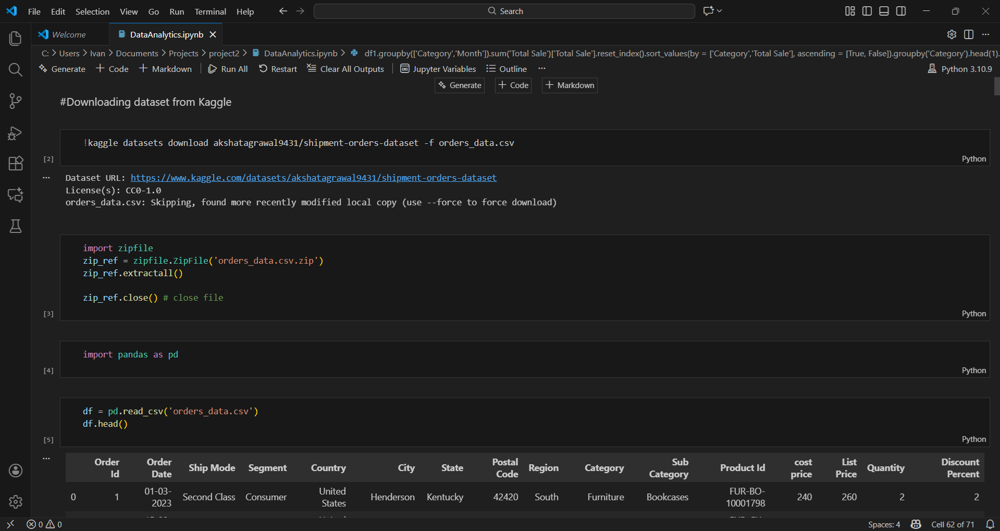

# 📦 Shipment Orders Data Pipeline & Analytics (Python + PostgreSQL)

This project demonstrates an end-to-end data workflow combining **Python**, **PostgreSQL**, **SQLAlchemy**, **psycopg2**, and **pandas** to practice real-world **data engineering** and **data analytics** skills.

The dataset used is the **Shipment Orders Dataset** from Kaggle.

---

## 🚀 Project Overview

This project simulates a realistic data process involving:

- Programmatic dataset download using the **Kaggle API**
- Extracting and preparing data with Python (`zipfile`, pandas)
- Loading cleaned data into **PostgreSQL** using SQLAlchemy + psycopg2
- Performing analytical and exploratory exercises in both **pandas** and **SQL**
- Using **pgAdmin4** to inspect tables and execute SQL queries

Although the project follows a YouTube tutorial for guidance, all work was independently reproduced and expanded for learning and practice.

---

## 🧠 Technical Skills Practiced

### 🔹 Data Engineering Skills
- Automated dataset retrieval using **Kaggle API**
- File extraction using Python (`zipfile`)
- Python-to-database connectivity via **SQLAlchemy** & **psycopg2**
- Loading DataFrames into PostgreSQL
- Managing and exploring relational databases in **pgAdmin4**

### 🔹 Data Analytics Skills
- Data cleaning & transformation with pandas
- Grouping, aggregation, and pivot tables
- Exploratory analysis: YoY trends, category insights, growth metrics
- Writing SQL queries for analysis and validation
- Combining Python and SQL in a unified workflow

---

## 🛠 Tech Stack

- **Python**: pandas, zipfile, SQLAlchemy, psycopg2  
- **PostgreSQL**  
- **pgAdmin4**  
- **Jupyter Notebook**  
- **Kaggle API**

---

## 📥 Dataset

**Shipment Orders Dataset**  
Source: Kaggle  
Link: https://www.kaggle.com/datasets/akshatagrawal9431/shipment-orders-dataset

---

## 📸 Project Screenshots

This section highlights key aspects of the workflow and final data output.

### 🐍 Jupyter Notebook Workflow

### 🐘 PostgreSQL Table in pgAdmin4

---

## 🔗 Reference Tutorial

This project was inspired by this YouTube walkthrough:  
https://www.youtube.com/watch?v=1icM6at9cC4&t=3852s
